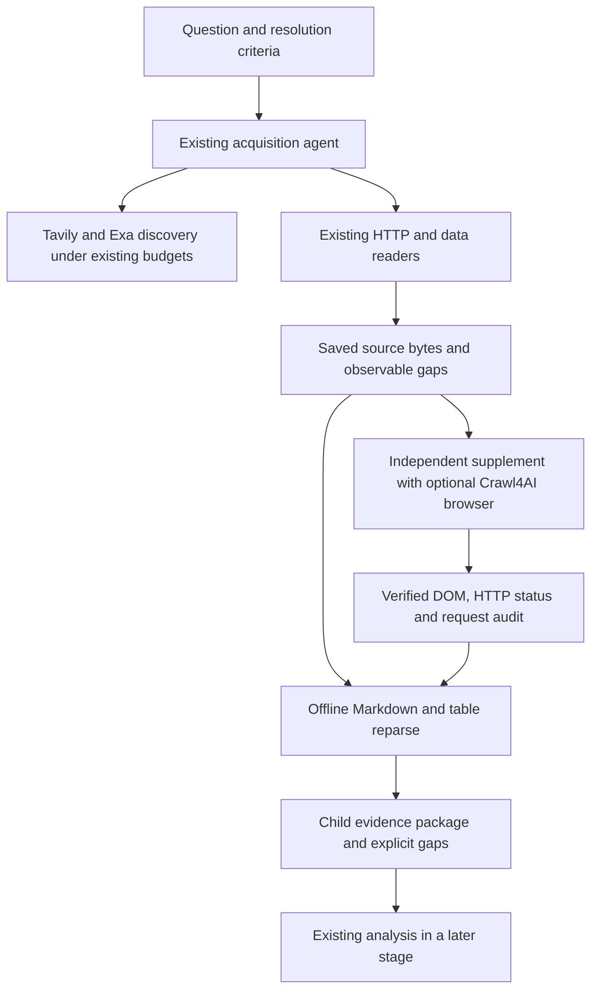

# Next-generation source acquisition: Crawl4AI experiment

## Status and baseline

This is an optional experimental backend on `codex/acquisition-next-crawl4ai`.
The starting point is the production library tag `v1.0.5`
(`8d067d6d4ff5eaaa80bea03de7ca11c88e5d101c`). The production worker is not
changed by installing this backend. Existing collection and analysis modules
are retained. Crawl4AI is pinned to `0.9.4`, upstream commit
`133e1d92e37885dfccc03ea2e3687d06c98b7ceb`.

The open-source Python library runs locally with Chromium. It does not require
a Crawl4AI API key. The separately hosted Crawl4AI Cloud service is outside
this experiment. Local browser CPU, memory and network are still resources.

## What the upstream project contributes

| Capability | Decision | Reason and constraint |
| --- | --- | --- |
| Async browser rendering, hooks, CSS waits, scrolling | Integrate as an optional supplement backend | Capture delayed HTML with explicit time and request bounds. |
| Markdown, citations and reference links | Integrate as additional reader documents | Preserve source bytes and the legacy body. Derived Markdown is not the original page. |
| Structured table extraction | Integrate with row and character limits | Retain cell grids, parent hashes and truncation warnings. Nested tables and complex headers need inspection. |
| BM25 content filtering | Optional reading projection | A filter can omit short notices and table rows. Never replace the archived material with fit Markdown. |
| Observed-link discovery | Integrate bounded same-host depth-one traversal | Details share the frozen total page allowance. Lexical relevance remains unverified. |
| CSS/XPath schema extraction | Defer to domain adapters | Useful for repeated official release formats; a generic schema cannot establish the correct metric or date. |
| BFS, DFS, best-first and adaptive crawling | Defer autonomous execution | Extra navigation must pass the existing task ledger before dispatch. Internal stopping rules do not replace our budget. |
| LLM extraction and LLM filtering | Defer | Avoid another model orchestration layer and hidden provider consumption. |
| Stealth, authenticated profiles, proxy services, CAPTCHA bypass | Exclude from this experiment | Use anonymous public pages and preserve access gaps. |
| PDF, CSV, JSON, spreadsheets and official APIs | Keep existing specialized readers | Browser conversion is not a substitute for structured source data. |

The upstream source was inspected, including `async_crawler_strategy.py`,
`content_scraping_strategy.py`, `markdown_generation_strategy.py`,
`table_extraction.py`, `antibot_detector.py` and crawler configuration/models.
In 0.9.4, `arun()` returns a result container, tables are in `ScrapingResult.media`,
and the upstream blocking heuristic can flag legitimate short pages. The adapter
accounts for these behaviors instead of treating tutorial pseudocode as an API.

## Architecture



`ForecastAgent.acquisition.nextgen pipeline` is an opt-in entry point. It runs
the release collection pipeline with a process-local replacement for the
supplement browser. The existing agent, searches, HTTP readers and supplement
reservations keep their original allowances. A frozen source-capture policy
records the adapter hashes. Completed HTML is also reparsed into a separate
`nextgen-package.json`, linked to the unchanged original package hash.

The substitution scope is one pipeline per process. It is restored on exceptions;
it is not a thread-safe global plugin registry. The capability catalog describes
tools and costs, but is not yet an additional set of agent-callable tool schemas.
Automatic CSS selector planning and autonomous whole-site exploration are not
implemented. Callers can supply a CSS wait in the bounded source experiment.

## Evidence and failure contract

- Save original HTTP bytes or UTF-8 rendered DOM, with SHA-256 and raw-kind labels.
- Store Markdown, tables and links as derived material with the parent hash.
- Preserve capture time. A later reparse gets its own `processed_at_utc`.
- Keep `raw_markdown` and `fit_markdown` separate. Neither establishes truth.
- Record HTTP state separately from body state. A successful crawl can be a
  blocked page, an empty shell or an HTTP error.
- Recognize short browser-verification pages; do not reject all short official
  notices based on an upstream anti-bot heuristic.
- Preserve denied rendered text for inspection. The legacy supplement cannot
  re-admit that text merely because it contains readable words.
- Store table inventory completeness, missing rows, truncation and header warnings.
- Current rendering is not proof of what existed at a historical cutoff.

## Bounds and accounting

The source experiment accepts at most eight pages, including observed details.
Default allowance is four. Each rendered page permits at most 25 dependency
requests, a 20-second operation deadline, at most four scroll steps and a 3 MB
DOM. It blocks writes, unnecessary images/media/fonts, WebSockets and service
worker registration. Redirect destinations and requests pass the public-URL
check. An origin validated at entry is reused within that render to avoid
repeated DNS timeouts. Final destinations are checked as well. There is no
authenticated profile. Counters describe routed dispatches; browser-managed
redirect hops are not a verified network transaction count. These application
controls are not a network sandbox or a defense against all DNS rebinding.
Offline reparse accepts up to 8 MB of already archived HTML, matching the
existing decoding limit. The smaller 3 MB browser-DOM allowance does not reject
larger existing source snapshots. Oversized table grids become explicit reparse
gaps; the original reader and package remain available.
When a render deadline expires after HTML has loaded, the adapter can save the
DOM already in memory without another navigation. Such material is classified
as a partial render with a gap; it is never counted as a completed render.

Cache is disabled in Crawl4AI; persisted captures belong to our journal.
`max_retries=0` disables its automatic retry policy. Every page reservation is
written before navigation. Failures and interrupted reservations consume the
allowance and are not silently rerun. A resume verifies capture and DOM hashes.
Changing input, code or policy requires a separately named experiment.

Source experiments and offline replay use zero OpenRouter, Tavily and Exa calls.
Running the full `pipeline --execute` does call the existing acquisition agent
and search providers. Its existing lifetime limits remain authoritative; the
eight-page source-experiment allowance is not added to those tasks.

## Install and run

Use an isolated Python environment. The optional dependency set is relatively
large (including upstream LiteLLM and browser dependencies), even when this
adapter makes no model calls.

```powershell
python -m pip install -r ForecastAgent/requirements-crawl4ai.txt
python -m playwright install chromium
$env:CRAWL4_AI_BASE_DIRECTORY = 'D:\metaculus\.tmp\crawl4ai-cache'
python -m ForecastAgent.acquisition.nextgen catalog
python -m unittest ForecastAgent.tests.test_crawl4ai_adapter
python -m ForecastAgent.acquisition.verify_nextgen --output snapshots/crawl4ai-fixture-proof
```

Source manifest example:

```json
{
  "schema": "source_manifest_v1",
  "mode": "live",
  "query": "official October inflation release",
  "max_pages": 3,
  "follow_details": false,
  "sources": [{"url": "https://example.org/statistics", "wait_for_css": "main", "scroll": false}]
}
```

```powershell
python -m ForecastAgent.acquisition.nextgen collect --input sources.json --root snapshots/crawl4ai-source-trial
python -m ForecastAgent.acquisition.nextgen reparse --input saved-page.json --output derived-page.json
python -m ForecastAgent.acquisition.nextgen replay --input package.json --root snapshots/crawl4ai-saved-replay
python -m ForecastAgent.acquisition.nextgen pipeline --input question.json --root snapshots/crawl4ai-task
# Explicit execution uses existing provider budgets:
python -m ForecastAgent.acquisition.nextgen pipeline --input question.json --root snapshots/crawl4ai-task --execute --supplement-network
```

The `crawl4ai_acceptance.yaml` workflow runs on Linux without API secrets, by
manual dispatch or a source change on `codex/acquisition-next-crawl4ai` only.
It installs Chromium and tests actual rendering against deterministic fixtures.
Preparing the workflow does not establish a successful GitHub Actions run.
For local tests with an already installed Chrome, use
`verify_nextgen --browser-channel chrome`. Bounded source experiments support
`collect --browser-channel chrome` as an explicitly frozen capture policy.
The default remains bundled Chromium. A 1.5-second rendered-DOM delay handles
some deferred content; arbitrary late-loading content still needs a CSS wait
or an explicit recorded gap.

## Validation and release gate

The next bounded experiment uses [paired source-reader trials](acquisition/PAIRED_READERS.md).
It freezes shared agent discovery and official-rule URLs before comparing
identical HTTP response bytes and alternating live browser captures. It does not
rerun search, analysis or submission, and it preserves explicit future-data gaps.

Use the same saved bytes for parser comparisons. For dynamic capture, freeze the
URLs, wait conditions and per-backend allowance before navigation. Report actual
requests, elapsed time, readable bodies, complete table rows and recorded gaps.
Do not infer forecast quality from the number of characters or Markdown size.

The first acceptance cases cover delayed content, a 200-row table, short official
text, browser verification, HTTP 403, raw corruption, public destination checks,
concurrent request bounds, interrupted reservations, resume hashes and the
legacy supplement seam. Additional real-source replay and live evidence are
saved outside source code under `snapshots/crawl4ai-next-20261008`.

Before production adoption, require Linux acceptance and a bounded
question-level paired collection trial. Review target metric/date/issuer recall,
not just technical readability. Decide whether browser lifecycle pooling is
needed after measuring memory and latency. Existing production release and
analysis remain in place until that gate passes.

## Initial validation: 2026-10-08

The local isolated environment used Crawl4AI 0.9.4, Playwright 1.63.0,
Patchright 1.63.0 and installed headless Chrome 154.0.8037.99. All 31 focused
tests passed, and the 47 frozen release dependency hashes remained valid.
The dependency download initially failed a hash check; installation continued
only after the complete official wheel matched its PyPI SHA-256.

| Evidence | Observed result | Interpretation |
| --- | --- | --- |
| Delayed HTML fixture | New reader captured the target 4.5% statement; release reader missed it | Supports the new waiting behavior on this fixture. |
| Long-table fixture | All 200 data rows recovered; the release table projection stored 100 lines including its header | Proves improved structured row coverage on identical table HTML. |
| Verification and HTTP 403 fixtures | Both excluded from readable evidence; source DOM retained | Failure text is not admitted as research material. |
| Slow dependency fixture | Already-loaded 4.5% notice retained with an explicit incomplete-render gap | Deadline handling preserves useful partial evidence without calling the render complete. |
| Eight archived question packages | All 23 HTML pages reparsed; hashes and original bodies preserved | Zero-network parser and classification replay. |
| Three archived Bank of Israel pages | Verification shells changed from old readable flags to recorded gaps | Corrects false readable status, without claiming recovered official content. |
| Public JavaScript page | 1,071 body characters captured | Real public browser operation succeeded. |
| Federal Reserve calendar | Initial timeout; repaired trial captured 11,397 body characters | Real source worked in the second bounded trial; network variability prevents causal A/B attribution. |
| Bank of Israel public page | Browser-verification DOM retained and classified as unreadable | This backend did not overcome the access barrier. |

The two live trials reserved three and two pages respectively, with independent
frozen identities and preserved first-run failures. No OpenRouter, Tavily or Exa
calls were made. No forecasts were analyzed or submitted. GitHub authorization
was rechecked and available. The new workflow was not registered on the default
branch, so a development-branch-only push trigger ran Linux acceptance without
changing the production branch.

[Linux acceptance run 37744969078](https://github.com/chenencc/futureeval-forecasting-agent/actions/runs/37744969078)
passed installation, all 31 focused tests, all five actual Chromium cases and
artifact upload on commit `8cd3a0132d040273440165bb53c8cd9ba927392c`.
The downloaded browser evidence was inspected, including the 200-row grid,
excluded challenge/403 bodies and partial DOM after a deadline. No production
readiness or forecast-quality improvement is inferred from these technical
tests. A question-level paired trial remains the next release gate.

## Primary sources

- [Pinned upstream release](https://github.com/unclecode/crawl4ai/releases/tag/v0.9.4)
- [Browser and crawler configuration](https://docs.crawl4ai.com/core/browser-crawler-config/)
- [Markdown and filtering](https://docs.crawl4ai.com/core/markdown-generation/)
- [Deep crawling](https://docs.crawl4ai.com/core/deep-crawling/)
- [Hooks](https://docs.crawl4ai.com/advanced/hooks-auth/)
- [Installation](https://docs.crawl4ai.com/core/installation/)
