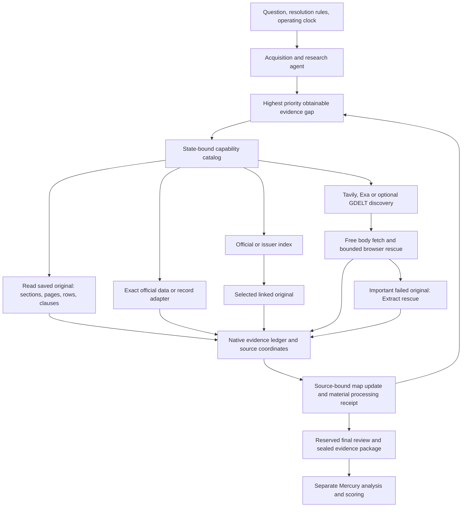

# Gap-driven acquisition with a shared evidence ledger

Status: development on `codex/official-intelligence-v106`. Channels donor:
`15d9f45`. Production is a separate release gate.

## One acquisition agent, many deterministic capabilities

The agent is selected through configuration; current development defaults to
Super. Tool implementations do not select models, call models or issue forecasts.
Maps guide acquisition and preserve claims, unknowns and relationships. A map is
an interpretation of evidence, not a verified causal model. Source contracts and
exact quotes are validated by code; semantic relevance remains an agent task.

## Choose a path for the gap

| Gap | Preferred action | Preserved identity and limits |
| --- | --- | --- |
| Already saved information | Outline, search, then read the exact part | Raw/body hashes, page/section/table coordinates; zero HTTP |
| Exact statistic | BLS, WorldBank, DBnomics or an existing official dataset | Series, period, unit, dimensions, footnotes and revisions |
| Company financial result | Curated issuer index and linked release; SEC if configured | Issuer/CIK, accounting concept, quarter versus cumulative period |
| Legislation or regulation | Official detail/actions, version index, then original text | Bill/package identity, text version and event stage |
| Recent public announcement | GovInfo/Fed feed or an observed official sitemap | Explicit bounded window, original candidate and timestamp |
| Unknown source or independent context | Targeted Tavily/Exa; GDELT for news leads if applicable | Query and returned metadata; leads do not count as bodies |
| Failed important original | Existing free reader/browser, then bounded Extract rescue | Failed attempts retained; replacement never overwrites original bytes |
| Future release or unavailable material | Record the exact gap and its next availability | No repeated request for an event that has not happened |

Do not force every channel on every question. Exact adapters require exact
identifiers. If the identifier is not supported by materials, first discover it.
Preserve resolution-rule primary sources even when an independent source is
easier to fetch. Match entity, metric, period, unit and legal/event stage before
using a source for a particular gap.

## Five program responsibilities

1. **Capability registry**: one schema and effect declaration per tool. Native
   dispatch, graph action feedback and tool menus consume the same registry.
2. **Source contracts and admission**: typed endpoint construction, required
   configuration, discovered URL ownership, original parent validation and
   response identity. No invented bill version or silent proposition conversion.
3. **Runtime ledger**: reserve every physical request before transport. Search,
   body HTTP, browser, Extract and model limits retain their existing owners.
   A toolbox journal is a mirror, never extra allowance. Each task retains its
   frozen budget; this integration increases no quota. For the original profile,
   Tavily remains at most three basic searches and Exa at most one search.
4. **Material admission**: distinguish discovery leads, structured observations,
   readable originals, unparsed files and unavailable/failed captures. Store raw
   bytes and metadata before graph interpretation. Failures remain inspectable.
5. **Research feedback**: bind claims to saved source spans; record what each new
   material changed or why it was not used. Only readable arrivals request map
   processing. An unchanged index, blocked response or empty file is not progress.

Received model replies, physical HTTP attempts and program-only recovery steps
have distinct counters. Reserved final map review is retained. Identical completed
channel operations replay without another request. A saved capture after an
interrupted projection can recover; an unknown transport outcome requires review.

## Boundaries that remain

- Twenty-three contracts cover specific public APIs; they do not provide universal
  government, finance or news coverage. BLS no-key access has a provider/IP limit;
  a per-task ledger is not that global quota.
- GDELT cooldown is task-local. Concurrent workers still need provider-wide rate
  coordination before high-volume GDELT usage.
- Current revised observations and today's bodies do not reconstruct historical
  information availability. Preserve collection time and do not call these
  leakage-free backtests.
- Office originals can be downloaded but are not parsed. OCR, robust PDF table
  reconstruction and hard Linux resource containment are separate capabilities.
- Missing SEC/Congress configuration is visible. This development integration
  does not onboard credentials or deploy workflow secret injection.
- Changed code identity prevents old frozen tasks from silently resuming. Archive
  the full task directory, including raw originals and its toolbox journal.

## Next measured validation

Freeze three to five unresolved questions across a numeric release, official
text/index chain and ordinary news. Keep model and task budgets fixed. Compare
the prior capability menu with this menu using saved material where possible;
record any newly fetched material with a separate timestamp.

Measure exact target-source selection, readable-original yield, target-field
coverage, retained gaps, HTTP/search/model attempts and processing receipts.
Review source relevance without exposing the version label. A successful fixture
or more documents alone is not evidence of improved recall or prediction quality.
Keep scoring fixed while evaluating acquisition. Broaden only after no new
request, provenance or recovery regression appears.
