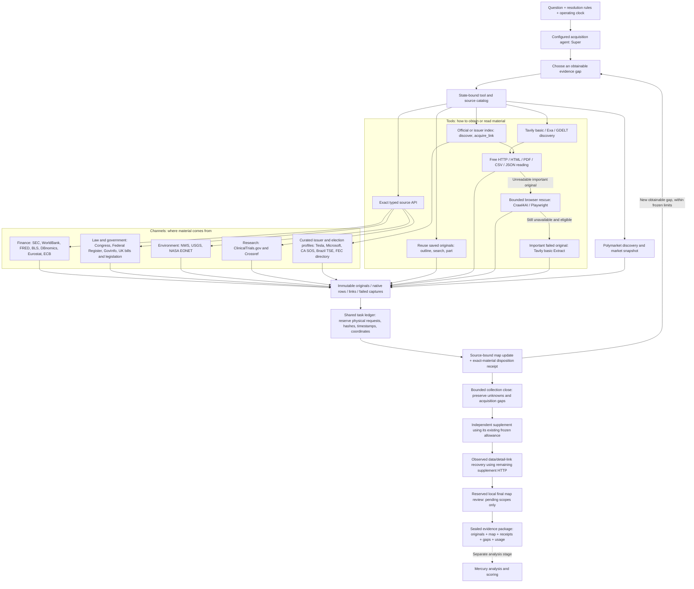

# Acquisition: tools, source channels and research feedback

This documents the development pipeline on `codex/official-intelligence-v106`,
including Channels donor `cc2fe12`. It is not a claim of production deployment.

## One acquisition flow

## The three boundaries

- **Tools** implement download, search, browser rendering and saved-original
  navigation. They do not choose models or forecast probabilities internally.
- **Source channels** implement exact API endpoints, source identity, required
  configuration, native row/metadata parsing, and curated original discovery.
- **The research agent** chooses the next obtainable gap and tool. The program
  validates parameters and provenance; the agent's source interpretation remains
  fallible. A saved receipt states incorporation, conflict, duplication, irrelevance
  or deferral for an exact source scope, not a truth or relevance certificate.

## Implemented channel inventory

| Family | Exact contracts / routes | Important preserved distinctions |
| --- | --- | --- |
| Finance: 10 contracts | WorldBank; FRED CSV; Fed news; SEC concept, companyfacts, submissions; DBnomics; BLS; Eurostat; ECB | Issuer, concept, fiscal period, dimensions, unit, footnote/status, filed and observation dates; revised data are not historical vintages |
| Politics: 11 contracts | Congress bill/actions/texts; Federal Register list/detail; UK bills/detail/publications/CLML; GovInfo feed/text | Bill stage, version, publication, enactment and commencement are distinct |
| Environment: 8 contracts | USGS; NASA EONET; NWS point/forecast/hourly/stations/observation/alerts | Location, station, issue time, valid time and observation time; active-alert emptiness does not prove event absence |
| Health: 1 contract | ClinicalTrials.gov | Registry/sponsor reporting does not verify clinical efficacy |
| Science: 1 contract | Crossref | Bibliographic metadata does not replace paper full text |
| News: 1 contract | GDELT | News lead inventory does not replace article original |
| Curated original profiles: 5 | Tesla IR; Microsoft IR; California elections; Brazil TSE; FEC directory | Exact linked originals require their own acquisition; these profiles are not universal election data APIs |
| Existing native channels | Tavily basic, Exa, free readers, browser rescue, Extract, Treasury/official datasets, Yahoo/ALFRED adapters, archives, Polymarket | Existing eligibility, freshness and shared budgets remain authoritative |

The 32 source contracts use `intelligence_fetch`; official index discovery and
linked-original download use separate task-owned actions. Fourteen additional
channel/navigation capabilities share the existing Capability registry. The
catalog lists source-specific parameters and current availability; a tool being
registered does not mean every source is configured or applicable to every gap.

## Budget, provenance and recovery

1. Freeze question/rules, code/schema identity and cumulative allowances.
2. Reuse saved material before another request. Local outline/search/part costs
   zero HTTP, search and model calls. Parsed views retain their raw parent.
3. Reserve each physical capture before transport, including explicit follow-ups.
   The toolbox journal is a mirror, not a second allowance. Original task profiles
   retain at most three Tavily basic and one Exa search; this integration raises
   no allowance. Configured experiments retain their own frozen limits.
4. Keep leads, complete observations, readable documents, unparsed files, empty
   results, truncation and failures distinct. More readable pages do not prove
   exact issuer, period, metric or stage coverage.
5. Preserve URL, raw/body hashes, capture time, source role, native metadata and
   quote coordinates. Source-bound processing uses current body AND reading scope.
6. Update the graph only for accepted changes. Receipt-only irrelevant/duplicate
   acknowledgments do not manufacture revisions. Changed bodies/scopes, retired
   incorporation, changed duplicate parents and deferrals remain pending.
7. Restore the complete task directory, including SQLite journal and raw files.
   A completed operation replays without HTTP; an unknown transport outcome
   remains reserved and requires review. Changed frozen code needs explicit
   derivative migration, never silent resume or budget reset.

The new source tools are available to the initial development acquisition agent.
Independent supplement and data recovery keep their existing implementations and
separate cumulative ledger owners; the new toolbox does not silently add another
network phase. Final map review reads saved material only. Polymarket retains a
separate market-signal role; use in analysis requires matching resolution rules.

## Validation and remaining gates

Nine new official sources were exercised through the real host with deterministic
transport fixtures: catalog/schema availability, one native reservation per request,
contact header forwarding, exact raw hashes, retained data rows and graph-readable
spans. Empty/truncated captures, missing or invalid contact configuration, complete
SEC byte ceilings and whole-directory restored replay were checked. No model or
paid search calls were made for this integration verification.

These are host integration checks, not a fresh unresolved-question recall trial.
Channels' public pilot evidence is retained in `OFFICIAL_DATA_VALIDATION.json`.
Linux browser/dependency containment, fresh agent source selection and forecast
quality remain separate release gates. Production is unchanged.
