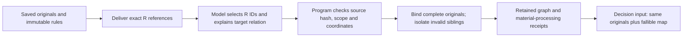

# Reference-bound research maps

This opt-in interface separates source text from model interpretation:

Enable a **new derivative task** through
`research_map.enable(request, reference_bound=True)`. This also enables target
links. The frozen field is `research_reference_map_policy=visible_original_reference_v1`.
Existing tasks and production policies do not change automatically.

## Model input and output

The model sees exact saved R spans and frozen T target IDs. Each observation
selects 1–3 delivered R IDs, leaves `hypothesis` empty, and supplies interpretation,
applicability, limitation and target links. It does not copy quotations, coordinates,
dates, units or stage-support quotes. Drivers, assumptions and unknowns contain
explicit `hypothesis` text with no R IDs. Relations remain optional.

The program stores the complete original spans in node bindings, retaining body
hashes, reading-view coordinates and parser provenance. A short program-generated
`claim` is a navigation label, **not a factual summary or quotation**.
`claim_origin=source_reference` distinguishes it from archived `source_quote`
observations. Long originals are not shortened to fit the claim field. Timing and
stage stay unknown in structured fields; model discussion of either stays in the
unverified interpretation. A measurement row can select an explicitly delivered
header/context ID. Missing context remains a limitation; it is not fetched silently.

## Checks and preserved boundaries

- Unknown, stale, duplicate, hidden and navigation-only references are rejected.
- Rejected observations stay rejected; they never become successful gap-only maps.
- Program-binding receipts distinguish binding candidates from retained nodes.
- Raw model replies, submitted proposal hashes and journal hashes remain auditable.
- Native merge/retire rules and material ownership checks remain in force.
- Binding is provenance verification, not truth, relevance, event-time or causal verification.
- Scoring cannot introduce source text absent from the original-only comparison.
  Decoded view coordinates must not be used as raw-body coordinates.
- Provider budgets, search/fetch counts and parent snapshots remain unchanged.

## Bounded validation

`ForecastAgent.research_loop.reference_map_trial` takes parent packages and their
previously frozen `common-originals.json` files. It compares copied-quote and
reference-bound interfaces with identical original text, model and allowances:
one physical Super HTTP attempt per case per arm, no retrieval, Mercury scoring
or submission. Re-entry uses saved results and never renews attempts. Known
regression snapshots establish interface behavior; they do not establish new-topic
recall or forecast quality. Check actual retained bindings and target explanations,
not acceptance counts alone.
