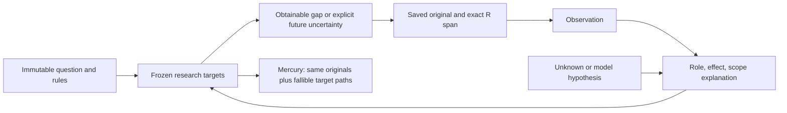

# Target-linked research maps

Status: opt-in development policy `source_bound_target_links_v1`. Production is
unchanged. This is a source-bound research structure, not a Bayesian network.

## One useful path

Enable through `research_map.enable(request, target_links=True)` or explicitly
set `research_target_logic_policy` in a NEW frozen experiment request. Existing
collection state must never be silently migrated. Models and provider budgets
retain their existing owners; there is no extra agent or nested model call.

## Node-to-target links

Each useful node declares `target_links`, an array of at most four entries:
`target_id`, `role`, `effect`, `reason`. IDs come from the existing frozen material
plan and inherit its original question references. That plan is an unverified
interpretation, not an exhaustive decomposition of the resolution contract.

- `direct`: exact target-applicable observation. Declaration is not verification.
- `indicator`: a leading signal; it does not establish the future realization.
- `baseline`: historical comparison with its original period preserved.
- `procedure`: event mechanics, with contextual effect only.
- `context`: background, with contextual effect only.
- `unknown`: unresolved missing information, never directional opposition.
- `driver`: explicit model hypothesis, separate from quoted observations.

Effects are `supports`, `opposes`, `context`, `unresolved`. Reasons explain the
specific event/value/option and scope. No probability, target value or outcome
label is part of this interface. Dependencies and conflicts may use the existing
relation schema; relation counts are not a success target.

## Mechanical checks and limits

Invalid target IDs, duplicate links, incompatible role/effect combinations and
background-as-direct annotations are isolated without changing a valid quote.
Pure Markdown headings and table separators cannot become observation nodes;
their original source text remains saved and readable. This narrow check does
not classify every title, short measurement or table header semantically.

Coverage reports all frozen targets as unassessed, unresolved, hypotheses only,
background only, indicators declared, or direct evidence declared. All states
remain unverified. No material requests and zero pending receipts are independent
of evidence adequacy. Missing links are never filled by code. Explicit retirement
and scoring-context omissions recompute coverage from retained/visible nodes.

Native context includes a compact coverage summary alongside the frozen targets.
Mercury receives target paths only from admitted map nodes; it may reject them.
The existing map byte ceiling and original-only fallback remain authoritative.

## Bounded verification

`ForecastAgent.research_loop.target_logic_trial` prepares paired map inputs from
one to five saved packages. It selects whole original spans once, pins exactly
the same user input in both arms, alternates arm order, fixes Super and output
budget, and reserves at most one physical model HTTP request per case and arm.
It performs no search, fetch, Mercury scoring, submission or quota reset. Failed
attempts and successful replies are durable; re-entry cannot replenish allowances.

The initial cases are repair regressions, not unseen generalization or forecast
accuracy tests. Review target period, entity and rule applicability in the actual
output. More links or a mechanically valid map alone do not prove improvement.
