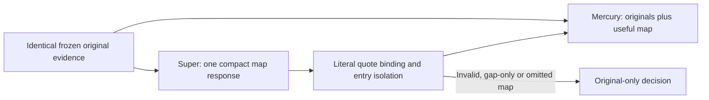
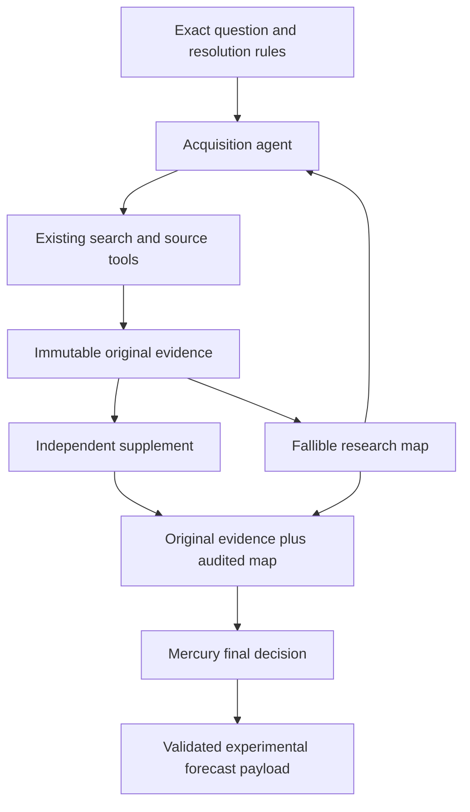

# Incremental Research Loop 0.1

Experimental development from `v1.0.5-crawl4ai.1`. Production remains unchanged.
This prototype adds revisable reasoning to acquisition and an independent final
Mercury decision. It does not implement a mandatory DAG, a CPT, or graph-based
probability arithmetic. It is not a new production release.

## Target-first delivery and forecast brief experiment

### Local-context selector experiment (v2)

`--context-protocol target-v2` is an additive, opt-in saved-text selector.
The default selector and production release remain unchanged. It retains local
date headings, complete Markdown rows and recognized date-first flattened rows
with their column labels. It prioritizes bounded quantitative and recent context
over repeated title matches and navigation. Every source keeps a small literal
identity passage; authority matches alone do not establish the correct page,
station, metric or time window. Omitted ranges and ranking signals are saved.

Literal date candidates are navigation hints. An old dated section cannot be
made recent by a future date inside its body. Dates, numeric strings and source
IDs alone are not measurements. The program neither fills missing observations
nor verifies model interpretations. Raw snapshots, rules, model prompts,
decision registry, scoring transport and stage budgets remain unchanged.

```shell
python -m ForecastAgent.research_loop.brief_trial --parents parents.json --root experiment/context-v2 --max-http 15 --brief-protocol references --context-protocol target-v2
# Add --execute only for the authorized frozen trial.
```

The five-case comparison uses archived control replies and a fresh v2 run.
Both selectors use the same saved bodies but deliberately different visible
spans. Within each run, direct and brief-assisted scores share the exact selected
originals. A change in scores is not evidence of improved calibration; selected
unresolved cases and single model draws cannot establish predictive superiority.

The opt-in `target-first-brief-paired-v1` experiment separates immutable source
preservation from visible input selection. It replaces the old selector's
mandatory passages with target-ranked context. Literal title name hints, metric
phrases, exact table rows and their local headers guide navigation. Rankings and
table structure flags do not certify relevance, completeness or applicability.
Missing projection windows remain gaps. Every delivered character is bound to
the original source hash and offsets; no source or provider ledger is modified.

Two forecast arms share exactly the same new selected original text, rules,
as-of annotation, decision registry and Mercury transport:

- Direct: Mercury reads the original evidence once.
- Brief: one Super response supplies baseline quotations, source assumptions,
  possible change factors and uncertainty; Mercury then reads that brief plus
  the same originals once. No numerical forecast is requested from Super.

The brief replaces construction work in this experimental route rather than
adding another map or verifier. Invalid quotes and dependent factors are
isolated. Unsupported period/unit annotations become unknown. A rejected brief
falls back to original-evidence scoring without a correction request. Mechanisms,
annotations and the forecasting frame remain fallible interpretations.

Each stage permits one physical request, with exact cache identity and persisted
reservations. A two-case pilot permits at most six requests total, with zero
searches, fetches, submissions or automatic rereads. It is a new bounded trial;
the preceding 35-request experiment remains exhausted and unchanged. Failure to
obtain a forecast is reported explicitly, with preserved state. Resuming never
renews a stage or experiment allowance.

After the initial six-request pilot, saved replies revealed a malformed optional
uncertainty list and a target-row quotation assigned to the header's handle.
The parser now isolates optional-field errors. A handle correction is permitted
only for a unique exact quotation in another already visible span of the same
source; hidden text, different sources, ambiguous matches and changed quotations
remain ineligible. Repairs and original proposed handles are recorded.
No quotation is shortened, rewritten or normalized to manufacture acceptance.

The saved replies were revalidated offline and scored in a separate recovery
ledger with at most two new Mercury requests and no new Super calls. The initial
six-request ledger remains immutable. Total observed pilot use was eight
physical requests, 59,808 known input plus output tokens, and zero reported cost.
Construction used 19,638 tokens versus 26,392 in the previous two-case map pilot;
this selected cost comparison does not establish improved forecast quality.

Both repaired comparison arms scored successfully. With identical original text,
IMF lower-tail mass was 29.7% direct versus 78.8% with a brief; Bo Nix YES was 9.5%
versus 4.2%. IMF retained only one literal baseline fact: a rewritten assumption
quotation and overlong quotations remained rejected. Bo Nix retained the target
row after exact same-source binding correction, but its applicable week remained
unverified. These selected unresolved cases support no accuracy or calibration
claim. The brief remains experimental and is not enabled in production.

Validation: 115 research-focused tests passed; all 58 archived inputs prepared
without HTTP or source mutation. Repaired scoring resumes from exact cached
requests without another provider attempt. Forecast completion and successful
brief-assisted paired completion are reported separately.

```shell
python -m ForecastAgent.research_loop.brief_trial --parents parents.json --root experiment/brief-v1 --max-http 6
# Add --execute only for an authorized live trial.
```

Packing comparisons use the same saved bodies but different visible passages.
They must not be labeled identical-visible-text model comparisons. The direct
versus brief experiment does have identical original coverage. Scores on these
unresolved, selected regressions cannot establish accuracy or calibration.

## Forecast evidence review (v3)

The opt-in `forecast-map-v3` protocol retains the source-first quotation contract
and adds source selection reviews to the same Super reply. An unpublished target
does not exclude useful earlier measurements, projections, plans or assumptions.
Each source group has a short role and a reason for use or exclusion. Group IDs
refer to exact captured body hashes; aliases stay visible and are not independent
confirmation. Reviews are an audit, not a relevance or completeness certificate.
Bad reviews never discard independently validated quotations and are not sent
to Mercury. There is no node quota, correction turn, causal verifier or new search.

For a literal observation, an unsupported source-stated time annotation is
quarantined separately. Its proposed value remains in the acceptance audit;
the accepted time becomes unknown. References and quoted text must still pass
every core check. Invalid quotations and stale or hidden handles remain rejected.
No date is borrowed from another span and no interpretation is certified true.
Legacy and v2 time acceptance remain unchanged for frozen controls.

V3 scoring uses an isolated transport with the same request identity, validation
and one physical attempt per arm. It records safe limit headers and any usable
Retry-After deadline. HTTP 429 without additional evidence stays a rate-or-quota
ambiguity. It does not automatically retry or refresh budgets. The frozen release
provider and production worker remain unchanged.

```shell
python -m ForecastAgent.research_loop.live_trial --parents parents.json --root experiment/v3 --map-protocol forecast-map-v3
```

Focused validation on October 9, 2026:

- 82 local tests passed. All 58 archived original views preserved their exact
  characters, coordinates, pages and provider ledgers; six had exact body aliases.
- Three construction requests inspected IMF, Peru and sports regressions.
  The IMF reply retained the 3.1 percent baseline. The Peru reply correctly kept
  a missing-election-data gap. Two IMF/sports map failures caused by date metadata
  were recovered from saved replies, with zero further construction requests.
- One new Mercury request scored the recovered IMF map. Its lower-tail mass
  below 2.55 was 56.8%, so retained evidence does not establish a better forecast.
- Three-map construction tokens rose from 32,885 to 36,287 (10.3%). The four new
  physical requests reported 80,236 input plus output tokens and zero cost.
  Cumulative use was 31 of the explicitly authorized 35 requests. No fresh
  retrieval, outcome-label access or submission occurred.

This is a selected, later-inference regression check, not held-out generalization
or a contemporaneous accuracy comparison. Preserve the direct-evidence control
and await independently verified outcomes before promotion. Missing target
sources require targeted acquisition; a graph cannot manufacture them.

## Source-first map experiment (v2)

The `codex/research-map-v2` branch adds an opt-in `literal-map-v2` protocol to
the saved-body B route. Acquisition, supplementation and production scoring do
not enable this protocol automatically. Archived v1 maps remain readable.



- Observations copy a contiguous original quote in `claim`. `interpretation`,
  `event_stage`, `applicability` and `limitation` remain separate, unverified
  model labels. Quote binding establishes provenance, not truth or meaning.
- There is no node or edge quota. A limitation can stay on its observation.
  Zero relations is valid; drivers and explicit gaps are used only when useful.
- Supporting/alternative narrative and revision prose may be empty in v2. The
  program uses neutral bookkeeping defaults for journal compatibility, without
  adding a fact, changing a quotation or making another model request.
- Causal hypotheses require a declared mechanism. Necessary/sufficient links
  require an exact immutable rule quote. These checks do not certify the
  mechanism, logical implication or event-stage interpretation.
- Repeated normalized quotations are grouped. Shared `episode_id` values are
  model hints about an event, release and period. Neither grouping proves source
  dependence or independent confirmation. The original sources remain intact.
- One normal Super response is allowed. The existing two-physical-request cap
  still bounds transport retries; malformed maps do not trigger model correction.
  Valid entries survive independently. Failed entries and raw output are archived.
- A gap-only map is retained in the research journal and omitted from scoring.
  If the map is invalid or cannot fit, B reuses the exact original-only decision
  and its receipt, rather than duplicating a Mercury call or dropping the case.
  A failed map-assisted score also reuses an already successful exact direct
  response when available; the failed HTTP receipt and unknown usage stay charged.
  This does not manufacture a result when both scoring arms failed.
  An original-only provider failure remains a failed scoring attempt, not a
  fabricated probability. Resuming never replenishes any allowance.
- Mercury keeps the unchanged originals, selector, registry, distribution
  validators, 0.02-0.98 policy and request/map byte caps. No map displaces source
  text. Each arm permits one physical Mercury request.

`simple_trial` freezes both implementations and inputs, alternates v1/v2 order,
and shares one exact direct A response per question. Every new and imported HTTP
receipt remains auditable; imported A usage is not counted as new consumption.
The initial five cases are an explicitly selected regression pilot, not a held-out
quality evaluation. Accuracy and Brier remain unavailable until independently
bound resolution labels exist. A single sample cannot establish robustness.

```powershell
python -m ForecastAgent.research_loop.live_trial --parents parents.json --root experiment/v2 --map-protocol literal-map-v2
# Add --execute only for the authorized external model experiment.
python -m ForecastAgent.research_loop.simple_trial --cohort cohort.json --ids 46073 46076 46099 46112 46114 --legacy-worktree D:\metaculus\.tmp\research_loop --root experiment/v2-paired
```

Local validation: 72 research-loop tests passed. Mechanical replay of 57 archived
maps preserved all 57 accepted current states and common original-text inputs.
These checks made no provider requests and do not establish prediction accuracy.

### Five-case pilot (2026-10-09 local date)

Identical saved originals were used for ISRO, India Supreme Court judges, IMF WEO,
Peru regional elections and Bo Nix passing yards. Fresh v1/v2 order alternated.
Super construction used nine physical v1 requests versus five v2 requests, and
98,024 versus 55,151 reported input-plus-output tokens. Original HTTP receipts,
failed calls, rule fields, pages, acquisition ledgers and input hashes were retained.

The first v2 validator rejected four maps for empty narrative fields. This
unnecessary legacy gate was removed; exact saved Super responses were replayed
without another Super call. Two maps were accepted for scoring. Three gap-only maps
used original-only scores. Mercury returned 429 for the India map score, so its
successful identical direct score was reused. Only the sports map-assisted score
completed. V1 sports direct and map scores both returned 429, leaving four complete
v1/v2 result pairs. This is not a complete graph-assisted predictive-quality comparison.

All five final v2 cases have valid experimental payloads. Total experimental
consumption was 27 physical requests within the authorized cap of 35, with 602,548
known input-plus-output tokens and three failed requests with unknown usage/cost.
Reported known cost was zero; missing usage remains unknown. No new searches,
fetches, submissions or quota resets occurred. On the four completed result pairs,
known full-route tokens were 266,077 for v1 and 213,495 for v2, including the direct
score attributed to every fallback. One failed v2 scoring request has unknown usage,
so this is a known-token comparison, not a complete cost estimate.

No verified official outcomes were loaded. Brier and accuracy are unavailable.
The two accepted maps use background evidence, not observed target-period outcomes.
The pilot proves reduced map calls, transparent gaps and bounded recovery; it does
not establish better forecasts. The final core runner's cached-score fallback is
also covered by a simulated 429 regression test; the live fallback used the audited
saved-response recovery helper.



## State contract

- Observations bind to program-issued saved-body IDs with exact offsets, text,
  body hashes, original-response hashes when recorded, and capture metadata.
- Drivers and assumptions are hypotheses. Unknowns preserve concrete reasons:
  not searched, not found, inaccessible, unpublished, ambiguous, or unreviewed.
- Supporting and alternative paths are required. Conflicting observations stay
  separate. Causal, evidential, necessary, sufficient, related, and contradicting
  relations are proposed interpretations, never certified causal structure.
- The program copies original rule fields. Model prose cannot replace the rules.
  A source-stated time must copy literal source text. Its role as an event date
  rather than publication date still requires reasoning.
- Three lifetime map revisions are allowed. A correction on unchanged material
  must be explicit. Every removed node must be retired. Prior states remain in a
  checksum-linked journal. Duplicate proposals return the saved revision.
- New supplemental sources mark the map as partially outdated; still-valid
  original bindings can be used. Changed or missing bound bodies invalidate it.
- Source independence, factual meaning, event timing, and relevance are not
  verified by coordinate checks. Syndication grouping is not yet implemented.

## Acquisition integration and budgets

Set `research_state_policy: incremental_research_v1` on a **new** task input.
The CLI selects the existing V3 acquisition strategy, Crawl4AI reader policy and
`nvidia/nemotron-3-super-120b-a12b:free` directly. Prompts and contracts do not name
the acquisition model. Existing model routing remains untouched elsewhere.
Use an explicit `collect --model` override for a separate future experiment;
the prepared input identity freezes that model and refuses a silent migration.

`inspect_research_state` reads bounded saved spans. `update_research_state` banks
the agent's interpretations. Both are local tools with no hidden model or search
requests. Updates use normal acquisition turns, preferably batched with review,
assessment or closure. They cannot grant acquisition progress or delay forced
closure. Tool availability does not guarantee that a model will build a useful map.

Existing caps remain: at most three Tavily basic searches, one Exa attempt when
enabled, eight initial shared source attempts, twelve model decisions and sixteen
model HTTP attempts per dispatch, seventy-two lifetime acquisition model attempts.
The existing deterministic supplement keeps its own unchanged allowances.
Interrupted reservations and completed tasks are not reopened. Changed input,
code, model policy or network mode needs a separate experiment identity.

## Final scoring and fair comparison

The frozen release selector prepares original evidence. The direct arm and map
arm contain **exactly the same original text, sources, question, and instructions**.
Only the additional, unverified map differs. Map observations whose full original
coordinates are not visible in both arms are omitted from scoring. The raw map
and omission audit remain available on disk.

The common request cap is 28,000 bytes including Mercury's questions. The map
has a 5,600-byte allowance. If it cannot fit, the program preserves original
evidence and falls back to direct scoring. No source text is displaced by a map.
Each scoring arm permits one physical Mercury attempt; restart never resets it.
There is no conditional second read in this initial experiment. Binary, multiple
choice, numeric, date and discrete payloads reuse the release's validators and
0.02-0.98 policy. Nonbinary platform metadata must be complete before any call.

All results remain experimental. No Metaculus submission or trading code is
called. Mercury may reject the map and must judge the exact original rules.
Historical current-page replay is not a leakage-free forecasting backtest.

## Commands

Run from the development worktree. All commands are dry/local unless `--execute`
is present. Supply credentials through the existing local project environment;
never place keys in these inputs or artifacts.

```powershell
# Inspect saved reference handles, without HTTP.
python -m ForecastAgent.research_loop inspect --bundle parent.json --limit 3

# Validate frozen saved-body contracts using a JSON list of parent paths.
# This generates explicitly synthetic proposals; it is not an accuracy test.
python -m ForecastAgent.research_loop.replay_validation --parents parents.json --root experiment/validation

# Bank a supplied proposal in a child artifact. Preserve the original parent.
python -m ForecastAgent.research_loop replay --bundle parent.json --proposal proposal.json --root experiment/replay

# Prepare equal-coverage Mercury inputs; no model calls.
python -m ForecastAgent.research_loop decide --bundle experiment/replay/research-package.json --root experiment/decision

# Separately execute one scoring arm. Each arm keeps its own one-attempt journal.
python -m ForecastAgent.research_loop decide --bundle experiment/replay/research-package.json --root experiment/decision --arm enriched --execute
python -m ForecastAgent.research_loop decide --bundle experiment/replay/research-package.json --root experiment/decision --arm baseline --execute

# Build actual Super maps on frozen originals, then compare both Mercury arms.
python -m ForecastAgent.research_loop.live_trial --parents parents.json --root experiment/live --execute

# Reuse an exact prior direct response; every original HTTP receipt is imported.
python -m ForecastAgent.research_loop.live_trial --parents parents.json --root experiment/bounded --baseline-from experiment/live --execute

# Evaluation requires independently archive-bound labels, outside provider packets.
python -m ForecastAgent.research_loop.evaluate_trial --root experiment/bounded --labels isolated-label-bindings.json

# Preflight a new complete collection task; add --execute to run acquisition.
python -m ForecastAgent.research_loop collect --input question.json --root experiment/collection
# Add --supplement-network only when bounded supplemental HTTP/browser work is intended.
```

Collection retains `collection/bundle.json`, the original pipeline `package.json`,
and an explicit child `research-package.json` plus `research-state.json`. The
research map is never written back into the immutable collection parent after
supplementation. Replays record parent checksums and leave all raw bytes and
provider ledgers unchanged. Decision folders contain both input arms, coverage
and byte audits, code/input identity, provider reservation records, and results.

## Actual saved-body experiment controls

The live trial uses explicit Super, a 4,500-token output ceiling and a separate
1,200-token reasoning ceiling. OpenRouter's public model metadata was checked
for support of that reasoning limit. Actual receipts must confirm its effect;
excluding returned reasoning alone does not reduce the reasoning budget.
The first real trial with `effort: low` consumed its output allowance on hidden
reasoning. Its failed receipts and original implementation remain archived.

The map reader partitions the exact selected original text into program-issued
R spans and unbindable context. It preserves every original character, question,
source and instruction, avoiding two competing citation vocabularies. Mercury
still receives the unchanged release evidence layout in both arms.

At most two physical Super requests per trial case include transport retries and
format correction. Mercury permits one physical request per arm. Restart never
replenishes either journal. An explicitly changed request policy requires a new
trial identity; earlier failed attempts remain in the complete experiment cost.
An exact earlier A request can be reused with its complete HTTP receipts and
checksum inventory. No imported receipt is counted as a new physical request.

Reports retain failed maps and metadata-blocked questions in their denominators.
Cost B includes Super construction and Mercury scoring, including failed requests.
Absent token or cost fields remain unknown. Providers can report different token
accounting; input-plus-output derivations must be labeled rather than substituted
for an absent total. Binary Brier, multiclass Brier and normalized bounded CDF loss
are evaluated separately by type, only with verified matching resolution labels.
These small, retrospective trials are not evidence of prospective forecasting alpha.

## Validation boundary

Offline tests cover exact bindings, stale material, atomic rejection, explicit
correction and retirement, journal tampering, lifetime caps, forced closure,
real runtime tool dispatch with simulated providers, equal original coverage,
all five payload types, clipping, caching, and interrupted attempts.
Saved-body mechanical replay checks format and preservation only. A supplied
proposal or simulated provider response is not evidence of model understanding
or forecast improvement. Next evaluate actual agent maps on a bounded frozen
cohort, then prospective unresolved questions, with failures and cost reported.

## Node acceptance and outcome binding

`acceptance.accept` validates the envelope, material identity, immutable rules,
revision and lifetime cap atomically. Each node is then checked independently
against the declared schema, exact saved-body handles and common arm coverage.
One failed node does not discard unrelated valid observations. Every duplicate
ID is quarantined. A malformed node is never repaired by silently dropping its
bad reference or changing its claim. An observation needs `gap_reason=none`;
its unresolved limitation belongs in a separate unknown node.

Relations and material requests referencing quarantined nodes are omitted.
Free-form paths are replaced with neutral instructions whenever an entry is
rejected, so discarded claims cannot reappear in narrative form. Raw proposals
and per-entry reasons remain in the experiment audit. The scoring pack omits
stale or invisible nodes and packs complete nodes within the existing allowance,
prioritizing grounded observations. It never displaces common original text.
No grounded observation means an unavailable map, except for an explicitly
unknown-only gap inventory. A gap inventory carries no factual grounding or
relationships, and neutral paths cannot assert nonoccurrence. Failed observations
cannot become gap-only merely because validation quarantined them. Stale gap
inventories are unavailable. Neither state triggers unlimited corrections or
renews provider budgets.
Binding acceptance does not certify interpretation, causality or source truth.

`regression` replays actual archived model outputs under strict and isolated
acceptance with no provider requests. Mechanical recovery is not a prediction
quality result. `freeze_trial` freezes a domain/type cohort from archived inputs,
with source checksums and isolated evaluation bindings. Each binding ties the
outcome to an independently archived title, rule, platform IDs, type, options,
metric unit, range metadata and source record. Bare ID-only labels, changed
contracts, contradictory labels and known source/metric conflicts are excluded
from paired metrics. Original conflicting labels remain preserved; a value in
a retrieved document is not silently substituted as the platform resolution.
Archive-bound metrics remain retrospective diagnostics, not prospective scores.

```shell
python -m ForecastAgent.research_loop.regression --parents parents.json --trials old-trial old-bounded-trial --root regression
python -m ForecastAgent.research_loop.freeze_trial --manifest source-manifest.json --ids 101 102 --root expanded --binary-source resolved_metaculus.jsonl --nonbinary-inputs core-20-inputs.json --nonbinary-records core-20-records.json
python -m ForecastAgent.research_loop.live_trial --parents expanded/parents.json --root expanded/live --execute
python -m ForecastAgent.research_loop.evaluate_trial --root expanded/live --labels expanded/isolated-label-bindings.json
```

The bounded v3 trial uses the same Super model, output/reasoning ceilings and
HTTP caps as v2. Only its node acceptance and explicit map guidance change.
Each new case has at most two physical Super attempts and one Mercury attempt
per arm. Both A and B are generated for the new cohort, with alternating arm
order. All failed attempts count toward B construction cost. This branch is
development only and does not alter the production worker or release analysis.

For unresolved saved-body cohorts, `cohort_trial` runs up to three isolated local
processes. Each process has its own unchanged lifetime request journals. Inputs,
platform IDs, source hashes, model policy, worker count and implementation are
frozen before HTTP. A is a fresh direct-evidence response; B adds a provisional
map to the same originals. Earlier release forecasts are separate references,
never inputs to either arm. Failed or unprocessed cases stay in the denominator.
New inference times are recorded in provider journals, never backdated to the
evidence capture time. Outcome labels are not read. Accuracy metrics wait for
independently archived official resolutions and temporal eligibility checks.

```shell
python -m ForecastAgent.research_loop.cohort_trial --cohort cohort.json --root saved-body-trial --workers 3 --execute
```

## Bounded stage repair

Map correction feedback identifies rejected nodes, invalid time fields and
literal date candidates in their exact visible reference spans. Candidate dates
do not certify event timing. The model must recheck the claim and table row or
leave timing unknown. The program never repairs a claim by dropping references,
borrowing a page header or manufacturing an observation.
Envelope errors do not conceal independently checkable node errors: both are
reported in the same correction. A failed map response can seed a separately
bounded continuation so the next request addresses its recorded errors directly.
Hidden reasoning and free-form response prose are not forwarded. Continuation
requires a finished earlier worker, matching original input and preserved receipts.
Successful map construction freezes the complete accepted journal before scoring.
Resumption restores that journal instead of generating a new event timestamp.
Older maps may restore their preserved research package only when the raw input
and accepted current state still match. Missing state is explicit, never invented.

`recovery.replay` is a separate offline conversion path for existing valid decisions.
It requires the exact original decision packet and registry, plus a matching
received HTTP request/response receipt. It does not alter the prior run identity,
renew a journal or call a provider. A changed raw bundle identity is reported
explicitly even when the actual decision packet is identical. Recovered outputs
are written separately from the original forecast.

The experimental distribution adapter validates provider probabilities strictly,
uses `math.fsum` for normalization and cumulative masses, and bounds only derived
rounding overflow within `1e-12`. It preserves open tails, platform grids and
the release payload constraints. Raw probabilities outside `[0, 1]` remain
invalid. A saved valid provider response can be converted again without HTTP.
The frozen release analysis code remains unchanged.

`repair_trial` allocates a separate bounded repair budget for explicitly selected
incomplete cases. It copies exact evidence and earlier A responses with their
HTTP receipts. Earlier failed attempts remain in cumulative consumption, and
resumption never resets the repair journals. It permits at most two new Super
requests and one new Mercury B request per case, with no new A request, search,
fetch or submission. Original trial outputs remain immutable. Earlier A and
repaired B have different inference times and must be reported separately from
the original contemporaneous experiment.

```shell
python -m ForecastAgent.research_loop.repair_trial --source saved-body-trial --ids 101 102 --root bounded-repair
python -m ForecastAgent.research_loop.repair_trial --source saved-body-trial --ids 101 102 --root bounded-repair --execute
python -m ForecastAgent.research_loop.repair_trial --source saved-body-trial --ids 102 --root bounded-map-continuation --previous-repair bounded-repair --super-http-cap 1 --execute
```

## Optional conditional scoring (development only)

`forecast-score-map-v4` keeps v3 literal evidence binding and time-annotation
isolation. The same Super reply may propose either a direct plan or one uncertain
world-event pivot with an exact entity, criterion, time window and mechanism.
Plans reference retained observation IDs. Unknown-only inventories and invalid
plans preserve the evidence and fall back to direct scoring. Plan shape and
coordinates are checked; causal meaning, relevance and truth remain unverified.
The current plan is hashed in the research event journal and cannot survive a
subsequent map revision implicitly.

`conditional_trial` runs at most five explicit frozen inputs with one physical
Super attempt and one physical Mercury attempt per case. Mercury receives the
same original coverage plus the optional plan. One request batches the direct
target, P(C), P(Y|C), P(Y|NOT(C)) and a fallible pivot-usability diagnostic. Choice
heads use the same exact option/bin identities in both branches. No new search,
fetch, label loading, hidden format repair or automatic reread is performed.

The program computes P(Y)=P(C)*P(Y|C)+(1-P(C))*P(Y|NOT(C)). For categories it mixes
the entire probability vector; for numeric/count/date questions it mixes the
common CDF grid, never averaged quantiles. It does not assume independence or
use source confidence as an event weight. Internal 0/1 values and open-tail mass
are retained; only final payloads use the existing release clipping/format rules.
Original provider answers, branch forecasts, the formula, direct and mixed raw
values, payload adjustments and request identities remain separately traceable.

**The primary forecast is always direct in this experimental version.** A
conditional result is a shadow candidate, not a replacement or ensemble member.
Absolute binary disagreement >=0.15, categorical total variation >=0.15 or maximum
CDF distance >=0.15 marks review; pivot usability below 0.65 also marks review.
These thresholds are preregistered diagnostics, not calibrated outcome guarantees.
Missing or malformed optional answers cannot invalidate a valid direct target.
A missing/invalid direct target is an explicit failure, never an invented 50%.
Review flags allocate zero additional HTTP requests in this first version, so
they cannot create a recursive scoring loop or block delivery of a valid direct
forecast. Any later reread requires its own bounded policy.

Inputs, implementation, model policy, physical cap and an optional previous budget
report are frozen before execution. Every failed/reserved request counts.
Resume uses exact cached maps/responses without refreshing quotas. A changed plan,
input, validation policy or implementation requires a separate experiment directory.

```shell
python -m ForecastAgent.research_loop.conditional_trial --parents parents.json --root conditional-pilot --max-http 4 --previous-budget earlier-budget-report.json
python -m ForecastAgent.research_loop.conditional_trial --parents parents.json --root conditional-pilot --max-http 4 --previous-budget earlier-budget-report.json --execute
python -m ForecastAgent.research_loop.conditional --bundle research-package.json --root score
```

The optional previous report must contain `usage.cumulative_http` and
`usage.authorized_cap`; the new physical cap cannot exceed its remaining room.
No worker workflow, release scoring module or production submission is changed.
Saved historical evidence can contain later information; these runs validate
mechanics and are not a leakage-free backtest. Prospective scoring quality awaits
independent resolutions under frozen evidence and eligibility checks.
## Reference-selected brief experiment

The opt-in `references` brief interface changes only Super's evidence citation
contract. `target_pack`, common Mercury originals, question registry, model
policy, output/reasoning allowances and one physical attempt per stage remain
unchanged. The legacy `literal` interface stays the default.

The program partitions current visible paragraphs and table lines into stable
reference IDs. Super selects IDs and records short interpretations and limits;
it does not copy quotations, character offsets, dates or units. The program
archives exact selected original text, source/body hashes and coordinates.
Literal date/unit tokens are navigation candidates, never certified event
timing or measurement units. Unknown IDs, duplicate selections, hidden text and
model-supplied bound fields are rejected. Exact binding does not verify meaning.
Malformed dependent factors are isolated; no valid references means direct
original-evidence scoring. There are no extra format correction HTTP calls.

Both scoring arms retain the exact common originals. Only B receives the short
fallible brief and program-produced reference locations. The archived originals
and old experiment journals are immutable. Reuse separate experiment roots;
changing code, reference profile, input identity or budget rejects continuation.

```shell
python -m ForecastAgent.research_loop.brief_trial --parents parents.json --root reference-trial --brief-protocol references --max-http 15 --execute
```

## Saved-brief semantic audit experiment

`brief_semantics` and `semantics_trial` are optional local diagnostics. They reuse
the exact saved originals, Super brief and event question registry. No collection,
production worker, model routing or final clipping policy is changed. Every prior
control JSON file is frozen by byte hash. A review uses one Mercury request;
scoring uses one request. Probe failures count in the same physical experiment cap.
Restart never renews reservations. Failed or absent review falls back to the same
original-evidence score, and the budget reserves final scoring attempts first.

Review probabilities classify each interpretation's support and role. They are
fallible model opinions, not evidence certificates or event weights. A claim needs
at least 0.80 support and a 0.25 margin for delivery. Explicit physical values need
their own literal value-unit pair in bound references; a nearby unit elsewhere in
the page cannot supply it. This deliberately conservative check does not certify
units inherited from table headers or converted values. Explicit conversions
remain subject to model review. Omitted commentary never deletes original text.
Review includes already visible context from the same source so a short quote does
not lose its document entity or table headers. It adds no saved body text beyond
the existing scoring packet. Context cannot substitute another measurement or
transfer units from an unrelated table; it is not an independent observation.

Free synthesis and dependent factors are archived but not passed forward because
they can introduce unreviewed numeric predictions. No manual probability correction
is allowed. The conversion audit keeps raw provider mass, normalized intervals,
raw CDF, final payload and clipping changes separately. Provider confidence is
never multiplied by an event probability. Extreme raw model tails remain visible.

```shell
python -m ForecastAgent.research_loop.semantics_trial --parent saved-brief-experiment --root semantic-audit --max-http 12
python -m ForecastAgent.research_loop.semantics_trial --parent saved-brief-experiment --root semantic-audit --max-http 12 --execute
```

Comparisons against archived scores are exploratory repeats, not controlled
simultaneous A/B trials. Unknown future outcomes cannot yield accuracy or Brier.
Synthetic known-answer probes check API mechanics, not forecast calibration.
